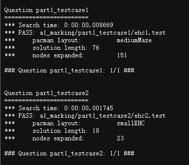
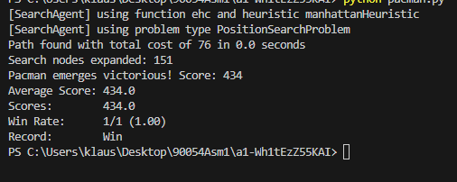
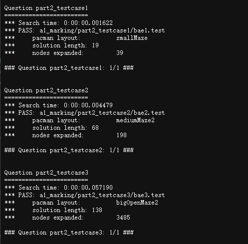
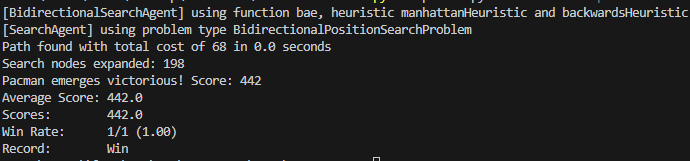
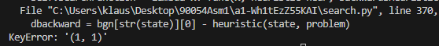
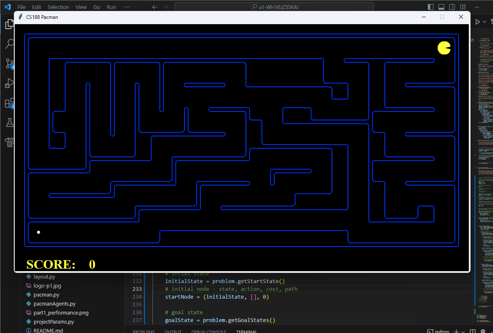
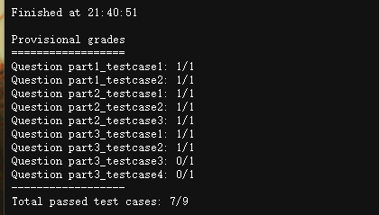

# Student Information

**Course:** COMP90054 AI Planning for Autonomy

**Semester:** Semester 2, 2023

**Student:**

Renfei Yu - 1394392 - reyu

> Replace the lines above with your correct details. Your student number should only be the **numbers**. For example: Guang Hu - 000000 - ghu1. 

**Collaborated With:**

> If you worked with another student, please include their **full name** and ask them to provide you with the **url to their github codebase**. Their codebase should be private, you will not have access to the code, so there's no issue with knowing their URL, e.g. Collaborated with: Lionel Messi - URL: github.com/what-a-worldcup.

# Self Evaluation

>**Note**
> Do not exceed 500 words for each Part. This is indicative, no need to have 500 words, and it's not a strict limit.

## Part 1
#### Self Evaluated Marks (3 marks):
3

#### Code Performance
These graphs are the running performance in my local aterminal and the server test. It reaches the destination successfully and past all the tests. Also, for the medium maze, it has 151 search nodex expanded which is better than A* algorithm in this case.

#### Learning and Challenges
in this part, I learnt how to implements the enforced hill climbing algorithm from the pseudo code given in the lecture slides, and get familiar with the mechanics of this game. Also, compare to reading the lecture slide, I have a deeper learning with this algorithm with the implmentation by myself.

I also faced some challenges like I don't know how to start with the code at first since I don't know the basic logic and mechanism behind this project. Moreover, I don't know how to implement the algorithm in detail at first. For example: in lecture slides, it shows "return extract-solution()" as the result of EHC output, but I don't know what actually I should return. After understanding the A* example, I finally realize what I should do.

Also, I haven't use python for a long time, so I need some time to warm up with these basic progamming skills as well.

#### Ideas That Almost Worked Well
I was trying to make the improve function inside the EHC function, if I do it in this way, I don't need to add the "problem" and "heuristic" as input for improve function again, since it is inside the EHC function. Also, there are no other functions that will call the improve function, so I was trying to write it inside the EHC function.

But I didn't do so for 2 reasons: first one is, in lecture slides, it seperated the two functions clearly, in order to implemnet the pseudo code more specifically, I choose to make them seprate.
Another reason is: it doesn't make sense to insert a function which would be called multiple times by EHC inside the EHC itself. So I make them seprate.

#### Justification
Firstly, the algorithm can search and find the destination successfully with the expansion nodes less than using A*. Secondly, it is just about implmenet the psudo code and there's nothing we need to improve with.

Also, it satisfies the properties of Heuristic Functions.

safe: since the heuristic value is decided by the manhatten distance, so there's no way that h(s) = infinity, so it is always safe

goal-aware: the heursitc value = 0 when reaching the goal state

admissible: the h(s) is the manhatten distance, so the actual optimal path h*(s) always >= h(s) since there is no way the actual path is same as the manhatten distance

consistent: the heuristic value is decided by the manhatten distance, and every step always cost 1 move, h(s) ≤ h(s’ ) + c(a) always satisfies, so it is consistent

#### New Tests Shared @ ED

## Part 2
#### Self Evaluated Marks (3 marks):
3

#### Code Performance

These graphs are the running performance in my local aterminal and the server test. It reaches the destination successfully and past all the tests. Also, for the medium maze, its total cost is 68, and its score is 442 which is kind of a good mark.

#### Learning and Challenges

I completed my algorithm in an early time, but I found two problems. 
Firstly, this error always happen, but I completely have no idea why this happens, so I debug for it for a long time and find that there's a foramt error in the data structure.

another challenge is, when I run the code after no error occurs, the pack man is standing at the intial state forever, and since there is no error popup, I can hardly identify what the problem is.
After read throgh my algorithm again, I found the problem and solved it.

#### Ideas That Almost Worked Well

At first, I just simply transfer the pseudo code into python code, then I found the openf and openb in the first two line is not same as set of open list. Since the open list should store the set of states which have been visited, and it should seperate from a priority queue that stores the nodes that have been visited, since the stage is different from node and the node may reopen some states under some condition. If I only use one set to store the list of nodes, then it's hard to identify which states have been visited, I can only traverse all the nodes in the set and compare whether it has the target state or not, that will be more complex when making an algorithm. Also, when expand one node's successors, the successors will be added into the priority queue, but they have not been visited yet, so they should not be added into the open list at this point, this is another reason to seprate the open list with the priority queue.

So I reconstruct my code and set two more set to store the states that not been visited yet (open list) in both forward and backward.

#### New Tests Shared @ ED

#### Justification
Firstly, the algorithm can search and find the destination successfully with a quiet good mark.

Also, it satisfies the properties of Heuristic Functions.

safe: since the heuristic value is decided by the manhatten distance, so there's no way that h(s) = infinity, so it is always safe

goal-aware: the heursitc value = 0 when reaching the goal state

admissible: the h(s) is the manhatten distance, so the actual optimal path h*(s) always >= h(s) since there is no way the actual path is same as the manhatten distance

consistent: the heuristic value is decided by the manhatten distance, and every step always cost 1 move, so it is consistent

## Part 3
#### Self Evaluated Marks (4 marks):
2.5

#### Code Performance
These graphs are the running performance in my local aterminal and the server test. It reaches the destination successfully and eat all the food. 

I past the autograde test in my local machine but only 2/4 for the server's test

#### Learning and Challenges
At first, it's hard to get started. Compare to the first 2 questions, the part3 is not like writing an algorithm for solving problem, instead, we need to think from the backward based on BAE algortihm which means we need to design for the problem that will get an optimal and complete solution for a BAE algortihm.

Also, its hard to design heuristic function as well since the previous questions all use Mannhatten distance so I don't know how to start with it.

Moreover, I was considering how to store the goal states for a long time. At the beginning, I thought the goal states can be stored in a list of states, each state contains its coordinator, but then I found there's a problem: in this condition, I cannot identify whether all the goal states have been visited -> so I don't know when to end the program.

The actual condition should be: if there are no other unvisited food states, then it achieved the goal state

So I modify it again to add a list as an attribute in each states to store the other food grid information.

#### Ideas That Almost Worked Well
At first, I don't know how to design a heuristic function, so I simply set all heuristic value to 0, which means all nodes have h-value of 0. In this case, it satisfies all properties of the heurist function:

safe- all the h-value are 0 so it will be safe

admissions- the actual optimal path h*(s) will always >= h(s) since the h value is 0

goal-aware- the goal state has h-value of 0 since all nodes have h-value of 0

consistent- all the h-value are 0 so h(s) ≤ h(s’ ) + c(a) -> 0 <= 0 + cost(a) always holds, so it is consistent

but then I found that if i take all h-value as 0, it will take a long time that the algorithm cannot get a good performance, so I rewrite the heurstic functions.

#### Justification
Firstly, the algorithm can search and find the destination successfully with a quiet good mark.

Also, it satisfies the properties of Heuristic Functions.

safe: since the heuristic value is decided by the max value between current distance nad manhatten distance, so there's no way that h(s) = infinity, so it is always safe

goal-aware: the heursitc value = 0 when reaching the goal state

admissible: the h(s) is the max value between current distance nad manhatten distance, so the actual optimal path h*(s) always >= h(s) since there is no way the actual path is same as the manhatten distance

consistent: the heuristic value is decided by the manhatten distance, and every step always cost 1 move, so it is consistent

#### New Tests Shared @ ED

